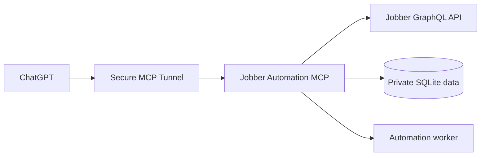

# Jobber Automation MCP

A self-hosted MCP server that lets ChatGPT inspect Jobber data and manage controlled automations. The same Docker Compose stack runs on macOS, Linux, and Raspberry Pi ARM64.

This is an early single-owner build. It is not designed for public or multi-tenant hosting.

Current release: **v0.2.0**

## Architecture



The MCP server defines the tools ChatGPT may call. The worker executes saved schedules even when no chat is open. The action catalog is intentionally controlled; automation definitions cannot execute arbitrary operating-system commands.

## Current capabilities

- Jobber OAuth authorization-code flow and rotating refresh-token support
- Jobber account, client, and job queries
- Read-only GraphQL and confirmed-mutation escape hatches
- SQLite persistence with WAL mode and a private database file
- Automation create, list, get, update, activate, pause, preview, run-now, history, and delete tools
- Manual and repeating interval triggers
- Log, Jobber query, and Jobber mutation actions
- Draft-on-create and draft-after-edit review lifecycle
- Per-run approval or explicitly preapproved automation policies
- Background scheduler with run and audit history
- Docker packaging compatible with macOS development and Linux ARM64 Raspberry Pi hosts

## Safety behavior

- New and edited automations are drafts and cannot run.
- Activation requires the exact phrase `I APPROVE THIS AUTOMATION`.
- A Jobber mutation automation using `always` approval cannot mutate from the scheduler.
- Its manual run requires `I CONFIRM THIS AUTOMATION RUN`.
- A `preapproved` mutation automation can run unattended only after its complete definition is reviewed and activated.
- Generic one-off mutations require `I CONFIRM THIS JOBBER CHANGE`.
- OAuth state is hashed, single-use, and expires after ten minutes.
- Every mutation attempt and automation result is audited.

## Installation

Start with the documentation that matches the task:

- [Installation and updates](docs/INSTALL.md)
- [Raspberry Pi deployment and migration](docs/RASPBERRY_PI.md)
- [Backup, restore, and rollback](docs/BACKUP_RESTORE.md)
- [Security policy](SECURITY.md)
- [Version history](CHANGELOG.md)

Quick local development setup requires Node.js 22.5 or newer:

```bash
npm install
npm run build
npm start
```

The database defaults to `./data/jobber-mcp.sqlite`.

## ChatGPT MCP endpoint

The local MCP path is:

```text
http://localhost:8080/mcp/YOUR_MCP_PATH_TOKEN
```

The included Compose file runs the OpenAI Secure MCP Tunnel alongside the server. Both published ports bind only to host loopback; do not expose them through router port forwarding.

## Automation definition example

```json
{
  "name": "Hourly account check",
  "description": "Verify that Jobber remains reachable.",
  "approvalPolicy": "always",
  "trigger": { "type": "interval", "everyMinutes": 60 },
  "actions": [
    {
      "type": "jobber.query",
      "query": "query Account { account { id name } }"
    }
  ]
}
```

The MCP tool creates this as a draft. Preview it, activate it, and then inspect its history.

## Development

```bash
npm run check
```

The test suite covers GraphQL operation separation and the local automation lifecycle.

## Release policy

Versions use `MAJOR.MINOR.PATCH` Semantic Versioning. Every release receives a Git tag and a matching changelog entry. Until v1.0, minor releases may include substantial changes that require reviewing the migration notes.

## Planned work

- Named Jobber tools based on the authenticated schema instead of generic GraphQL
- Calendar/cron, Jobber polling, and webhook-relay triggers
- Conditions, templates, notifications, retries, and idempotency keys
- Embedded MCP Apps automation dashboard
- Encrypted or operating-system-backed token storage
- Automated backup verification and simpler restore commands
- Purpose-built scheduling and visit-management workflows

## Important limitations

- Scheduled work runs only while the host is awake and the server is running.
- A Secure MCP Tunnel connects ChatGPT to MCP; it is not a general inbound Jobber webhook endpoint.
- Jobber fields and mutations must be verified against the authenticated schema and selected API version before production use.
- Do not expose the local port directly to the public internet.

## License

Released under the [MIT License](LICENSE).
